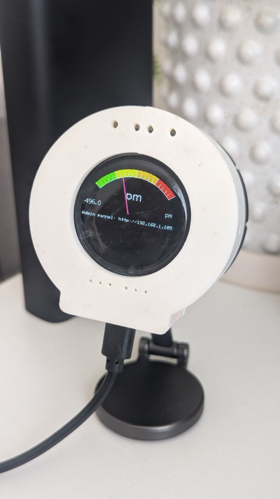

# AirQualityMonitor

A smart air quality monitor based on ESP32 and CCS811 sensor

## Features

1. Measures eCO₂ and TVOC levels  
2. Publishes the data to MQTT topics  
3. Displays CO₂ levels on a screen and via an RGB LED

## How to
1. Please edit `.pio/libdeps/mhetesp32devkit/TFT_eSPI/User_Setup_Select.h` uncomment `#include <User_Setups/Setup200_GC9A01.h>`;
2. Rename `src/configs/secrets.example.h` to `src/configs/secrets.h` and edit - use correct wi-fi and mqtt creds; 
3. Optional. Edit `src/configs/config.h`;
4. Upload and enjoy!

## Links

- [Source Code](/src/)
- [Wiring Diagram](/resources/)  
  
- [3D Printed Case](/3dprint/)  
  

> Reduce the model by 10 times before printing!
