# User Manual  
---
## Table of Contents  
1. [Introduction](#introduction)  
2. [Device Overview](#device-overview)  
   - 2.1 [Components](#components)  
   - 2.2 [Interface](#interface)  
3. [Getting Started](#getting-started)  
   - 3.1 [Installation](#installation)  
   - 3.2 [First Power-On](#first-power-on)  
   - 3.3 [Connecting to Wi-Fi](#connecting-to-wi-fi)  
4. [Interface Overview](#interface-overview)    
5. [Advanced Settings](#advanced-settings)  

  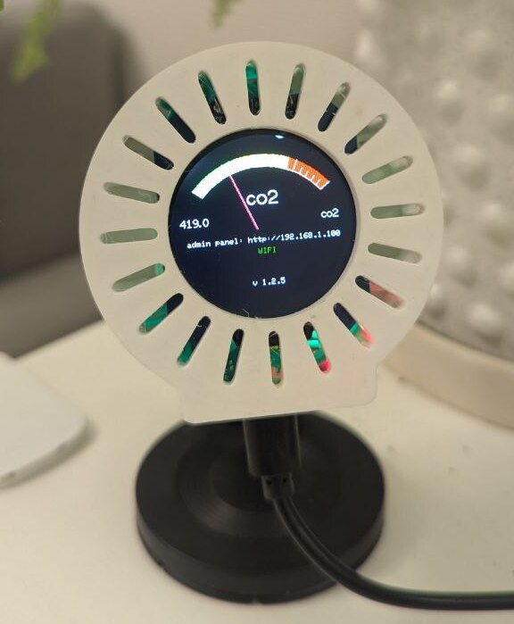

## Introduction  
Air Quality Monitor (AQM) is an IoT (Internet of Things) device designed to measure indoor CO₂ levels and transmit real-time data visually via an RGB LED and remotely to Yandex via MQTT.  

## Device Overview  
### Components  
1. **Front Panel**:  
   - 1.28" IPS Round Display  
2. **Rear Panel**:  
   - Micro-USB Port (for power and firmware updates)  
3. **Internal Components**:  
   - CO₂ Sensor (CCS811)  
   - Microcontroller (ESP32-based)  
   - RGB Indicator  

## Getting Started  
### Installation  
1. Place the device on a flat surface (desk or wall) at 1-2 meters above breathing level.  
2. Ensure no obstructions block ventilation holes.  

### First Power-On  
1. Connect the Micro-USB cable to a 5V/1A power source and the device.  
2. The screen will display sequentially:  
    - Step 1: Wi-Fi Status (see [Connecting to Wi-Fi](#connecting-to-wi-fi))  
    - Step 2: CO₂ Initialization
      

  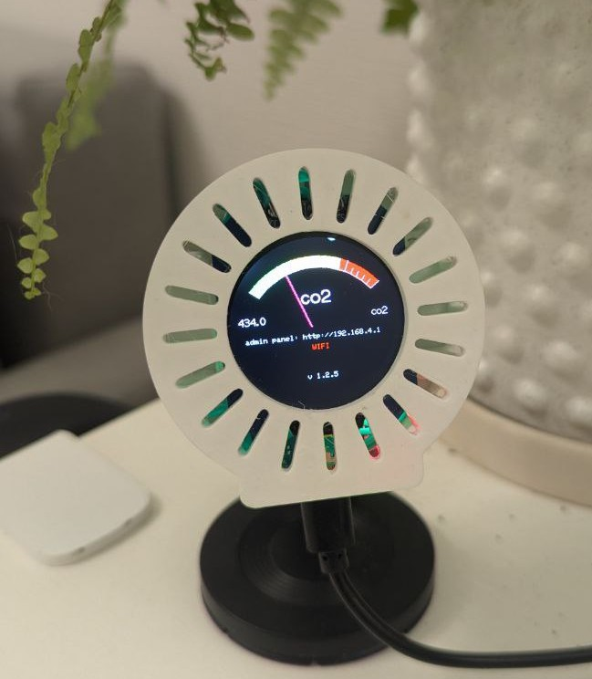
  <h5 style="text-align:center"></h5>

  

### Connecting to Wi-Fi  
1. Connect to the device’s access point (`AQM-AP`).

  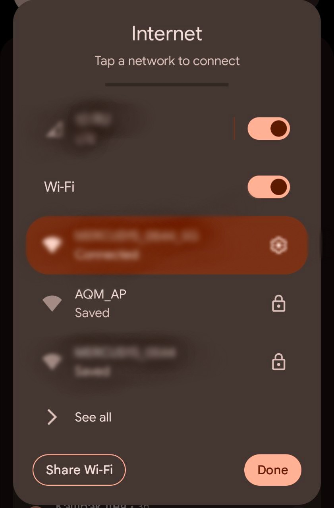
  <h5 style="text-align:center">Device creates an access point</h5>

 

2. Open a web browser and navigate to the address shown on the display (usually `http://192.168.4.1`; actual address may vary).

  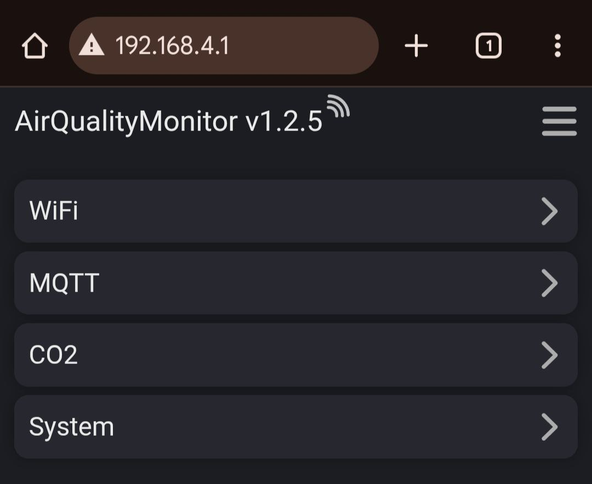
  <h5 style="text-align:center"></h5>

 

3. Select the **WIFI** menu item, enter your Wi-Fi network credentials (name and password), and click **Save**.  
**Note**: After saving, the device will reboot and attempt to connect. Connection status updates will appear within seconds.

  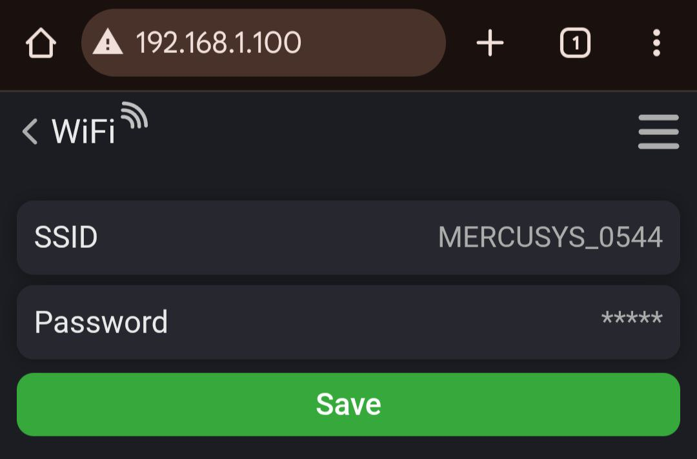
  <h5 style="text-align:center"></h5>

## Interface Overview  
### Device Interface  
| Element                   | Description                                                                 |
|---------------------------|-----------------------------------------------------------------------------|
| **CO₂ Meter**             | Visual gradient with color zones: green, yellow, orange, red               |
| **Current CO₂ Value**     | Current eCO₂ value (e.g., "850.0"). Min/max display values: 400.0 / 1500.0 |
| **Web Panel Link**        | URL to the web panel (e.g., `http://192.168.1.100`)                       |
| **Network Status**        | Internet connection status (green = connected, red = disconnected)        |
| **Calibration Status**    | Teal "CALIBRATION" text during calibration                                |
| **Firmware Version**      | Current firmware version (e.g., "v1.0.0")                                |

### Web Panel  
Accessible at `http://[device-address]`, includes:  
1. **Wi-Fi**:  
   - SSID and password settings.

  
  <h5 style="text-align:center"></h5>

  

2. **MQTT**:  
    - **Enable**: Toggle message publishing.  
    - **Host**: Server IP/URL.  
    - **Port**: Server port.  
    - **Username/Password**: MQTT credentials.  
    - **Device ID**: Unique server identifier and topic prefix.  

  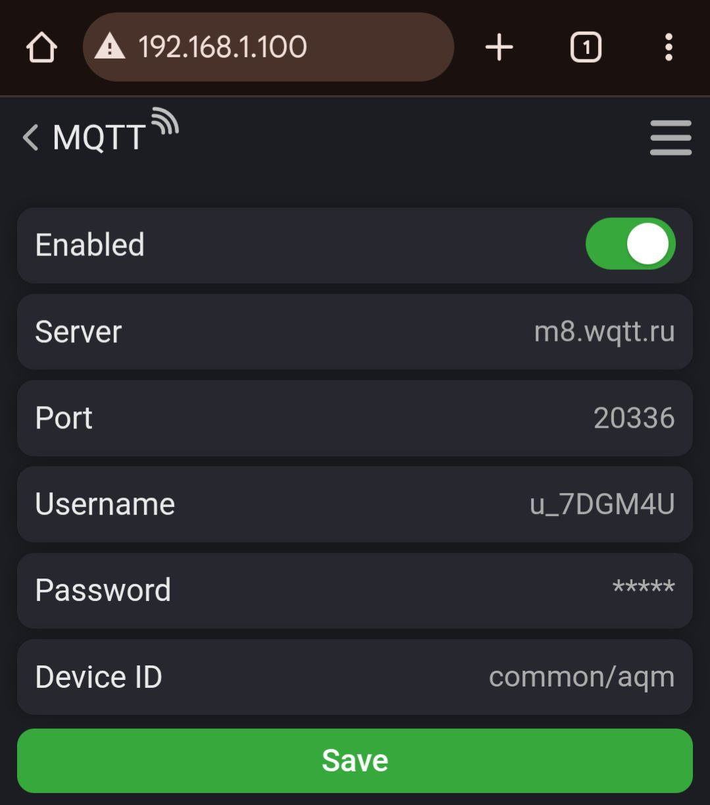
  <h5 style="text-align:center"></h5>

  

3. **CO₂**:  
   - **Alarm value**: Set warning thresholds.  
   - **Scale type**: Choose DEFAULT (4-color) or EASY (3-color) gradient.  
   - **Calibration**: Start/stop calibration buttons.  

  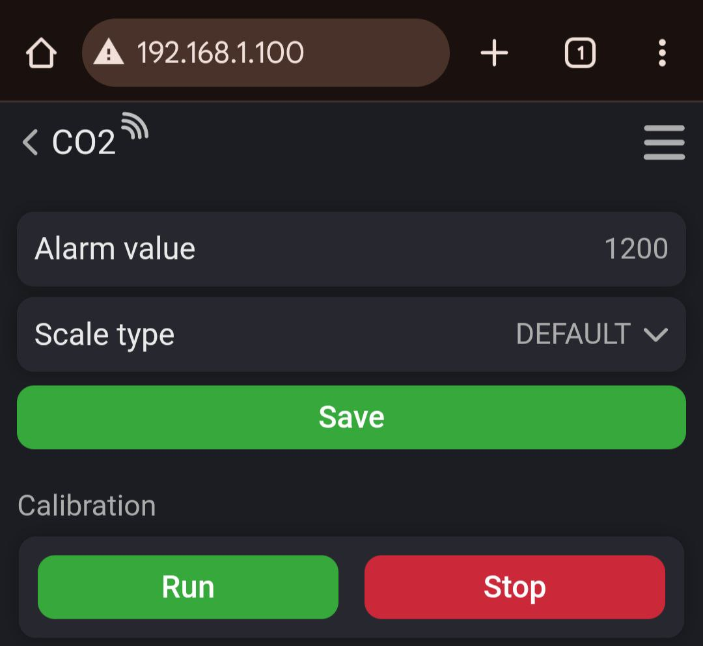
  <h5 style="text-align:center"></h5>

  

4. **System**:  
   - **Use dark theme**: Toggle light/dark mode.  
   - **Log**: Set logging level.  
   - **Firmware update**: Upload and install new firmware. 

  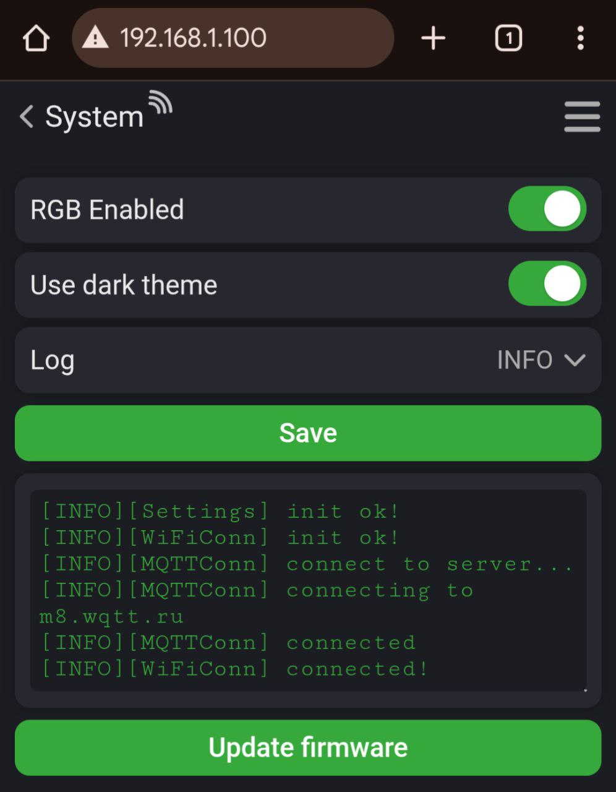
  <h5 style="text-align:center"></h5>

  

## Advanced Settings  
### MQTT Configuration  
- Configure connection to your MQTT broker (host, port, credentials).  
- Set a unique device ID to avoid topic conflicts. 

  
  <h5 style="text-align:center">MQTT broker settings</h5>

  

## Example Using [wqtt.ru](https://wqtt.ru) (Freemium Broker)
### Broker Configuration  
1. Go to the [wqtt.ru](https://wqtt.ru) homepage.  
2. Sign up or log into your account.  
3. Navigate to [Settings](https://dash.wqtt.ru/settings/). 

  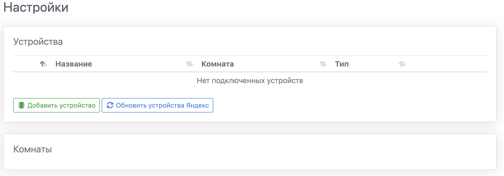
  <h5 style="text-align:center"></h5>

  

4. Click **Add Device > Sensor**.  
5. Enter a **Device name** (e.g., "AQM") and **Room name**.  
6. Under **Advanced Settings**, select **Sensors > Add > Float**.  
7. Choose **Type > Carbon Dioxide** and set **Topic** to `common/aqm/co2`.  
8. Repeat step 6 for TVOC, setting the topic to `common/aqm/tvoc`.  
**Note**: The prefix `common/aqm` corresponds to the **Device ID** specified in the MQTT settings.  

  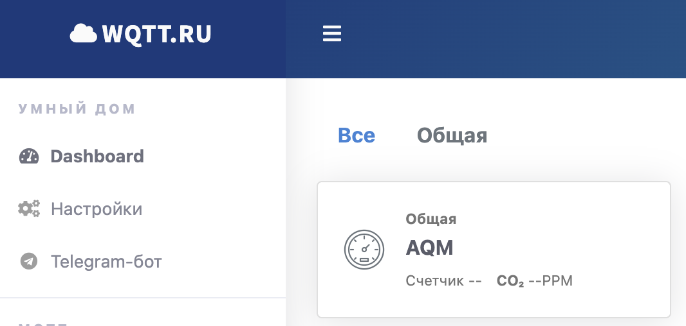
  <h5 style="text-align:center">Device appears after successful setup</h5>

  

9. Copy broker details from the **Broker** section and enter them into the web panel's MQTT menu:  
    - **Address** → Server  
    - **Port** → Port  
    - **User** → Username  
    - **Password** → Password 

  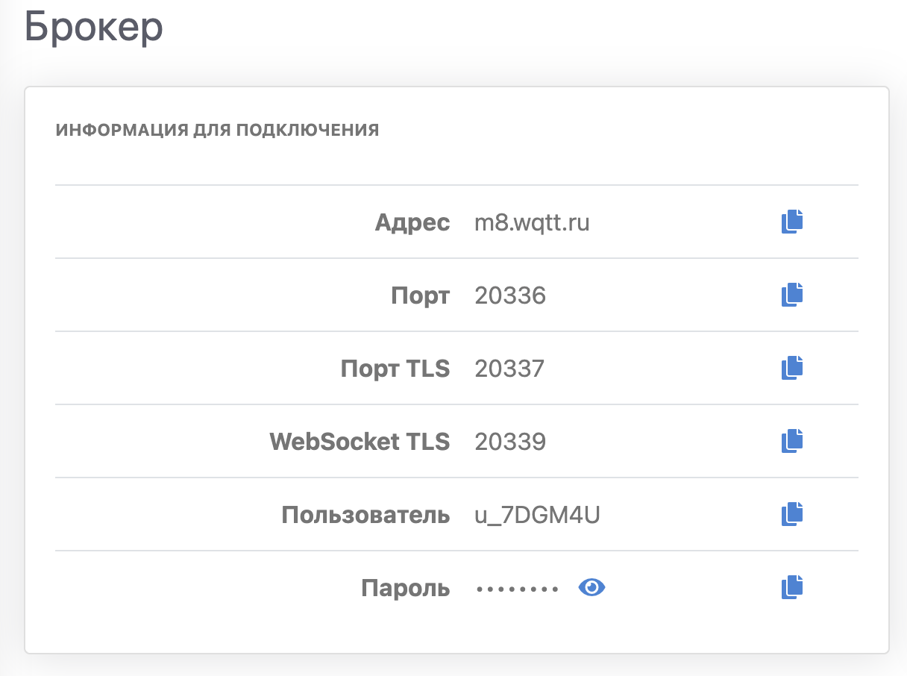
  <h5 style="text-align:center">Broker settings</h5>

  

### Yandex Smart Home Integration  
1. Open the **Yandex Smart Home** app.  
2. Go to **Smart Home Devices**.  
3. Search for **WQTT.RU** and click **Link to Yandex**.  
4. Log in with your [wqtt.ru](https://wqtt.ru) account credentials.  
5. Click **Refresh Device List**; your **AQM** should appear.  
6. Assign a unique Cyrillic name (e.g., "Датчик воздуха").  
7. Reboot the device. Data will sync within minutes. Configure scenarios like CO₂ level alerts.  

### MQTT Testing (Without Sensor)  
A sample Go script in `scripts/mqtt_tester` can publish random values to the topic.  

### Dark Theme  
- Toggle theme under **System > Use dark theme**.  

  
  <h5 style="text-align:center">Theme toggle</h5>

  

### Sensor Calibration  
- Manual calibration is recommended even with automatic calibration:  
  - Daily for the first 7 days.  
  - Every 1-28 days after the first week.  
- **To calibrate**:  
  - Place the device in clean air.  
  - Go to **System > Calibration** and click `run`. Confirm "CALIBRATION" appears.  
  - Wait ~20 minutes, then click `stop`.  
  - Reboot the device. If issues arise, the sensor will restore the last calibration.  

  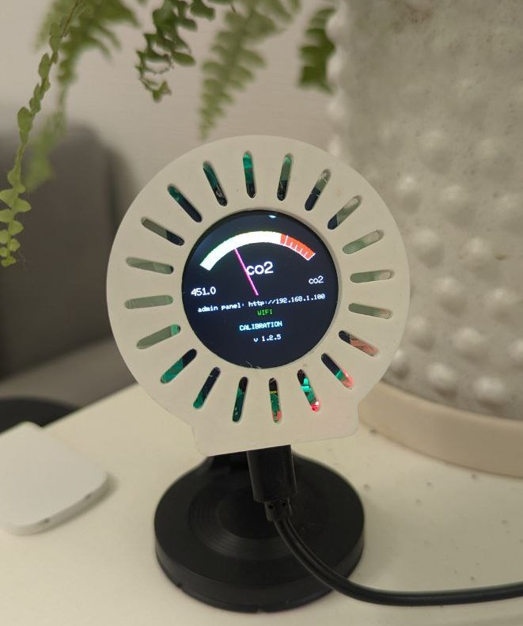
  <h5 style="text-align:center">Device in calibration mode</h5>

  

### Firmware Update  
- Navigate to **System > Update firmware**.  
- Wait for the device to reboot. The new firmware version will appear in the web panel header.  
- Alternatively, download the firmware (in `bin` folder) and upload `firmware.bin` via **OTA** menu.  

  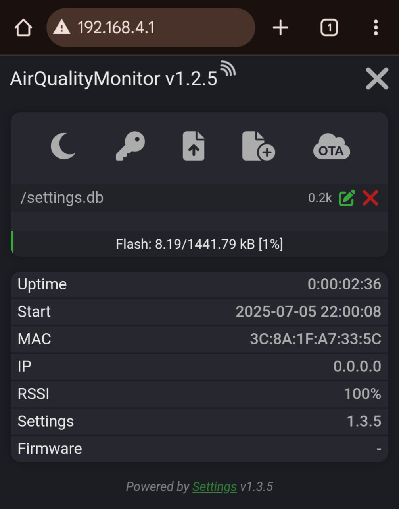
  <h5 style="text-align:center">Maintenance menu (accessible via top-right icon)</h5>

  