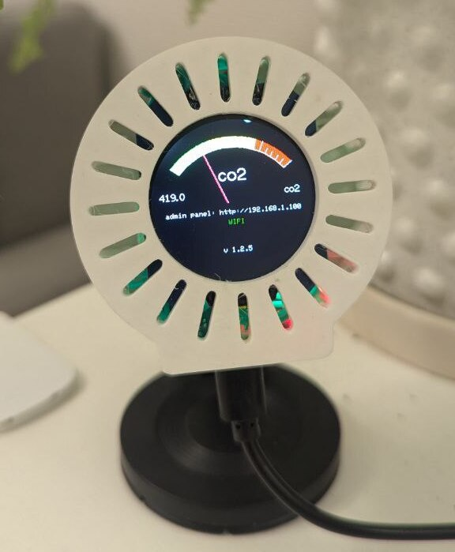
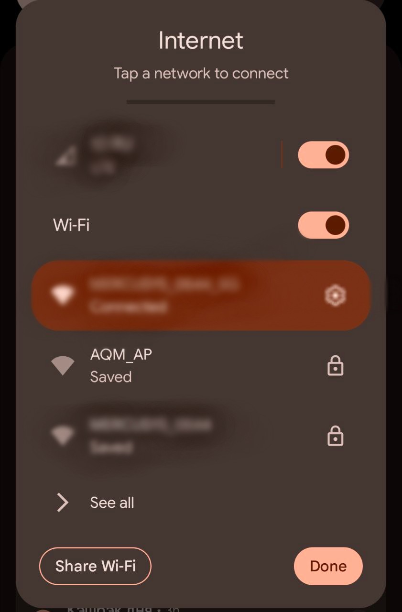
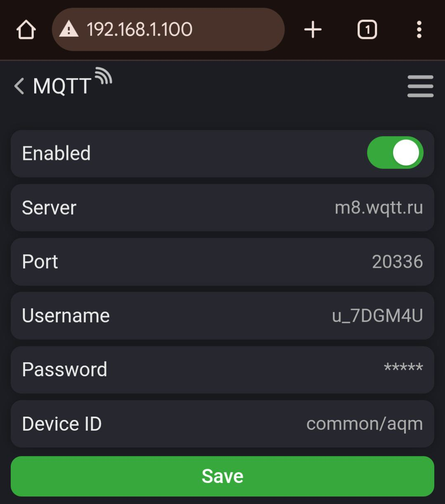
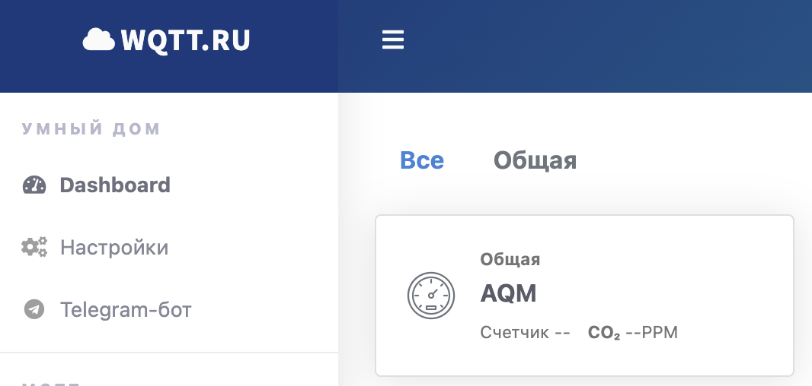

# [РУС] Пользовательское руководство

---

## Содержание  
1. [Введение](#введение)  
2. [Обзор устройства](#обзор-устройства)  
   - 2.1 [Компоненты](#компоненты)  
   - 2.2 [Интерфейс](#интерфейс)  
3. [Начало работы](#начало-работы)  
   - 3.1 [Установка](#установка)  
   - 3.2 [Первое включение](#первое-включение)  
   - 3.3 [Подключение к Wi-Fi](#подключение-к-wi-fi)  
4. [Обзов интерфейсов](#обзор-интерфейсов)    
5. [Расширенная настройка](#расширенная-настройка) 

  

## Введение  
Air Quality Monitor (AQM) — это устройство Интернета вещей (IoT), предназначенное для измерения уровня CO₂ внутри помещения и передачи данных в реальном времени визуально, с помощью RGB светодиода и удаленно в Yandex через MQTT.

## Обзор устройства  
### Компоненты  
1. **Передняя панель**:  
   - 1.28" IPS круглый дисплей  
2. **Задняя панель**:  
   - Микро-USB разъем (для питания и обновления прошивки)  
3. **Внутреннее устройство**:  
   - Датчик CO₂ (CCS811)  
   - Микроконтроллер (на основе ESP32)  
   - RGB индикатор   

## Начало работы  
### Установка   
1. Установите устройство на ровную поверхность (стол или стену) на высоте 1-2 метра от уровня дыхания.  
2. Убедитесь, что нет препятствий для вентиляционных отверстий.  

### Первое включение  
1. Подключите Micro-USB кабель к источнику питания 5V/1A и к устройству  
2. На экране будет последовательно отображаться:  
    - Шаг 1: Статус Wi-Fi (см. раздел [Подключение к Wi-Fi](#подключение-к-wi-fi))  
    - Шаг 2: Инициализация CO₂

  
  <h5 style="text-align:center"></h5>

   

### Подключение к Wi-Fi  
1. Подключитесь к точке доступа устройства (`AQM-AP`).

  
  <h5 style="text-align:center">Устройство создает точку доступа</h5>

2. Откройте веб-браузер и перейдите по адресу отображаемым на дисплее. Обычно это `http://192.168.4.1`, но адрес может отличаться.

  
  <h5 style="text-align:center"></h5>

  

3. Выберите пункт меню **WIFI**, введите параметры вашей Wi-Fi сети (название и пароль). Нажмите кнопку **Сохранить**.  
**Примечание**: После сохранения устройство перезагрузится и попробует подключиться к сети. Обновление статуса соединения появится через несколько секунд.  

## Обзор интерфейсов 
### Интерфейс устройства  
| Элемент                    | Описание                                                                 |
|----------------------------|--------------------------------------------------------------------------|
| **CO₂ измеритель**               | Визуальный градиент с цветовыми зонами: зеленый, желтый, оранжевый, красный |
| **Текущее значение CO₂**   | Текущее значение eCO₂ (например, "850.0"). Минимальное/максимальное отображаемое значение = 400.0 и 1500.0 соответственно                            |
| **Ссылка на веб панель** | Ссылка на веб панель (например, `http://192.168.1.100`)  |
| **Статус сети**            | Статус подключения к интернету (зеленый - подключен, красный - не подключен) |
| **Статус калибровки**      | Берюзовый текст "CALIBRATION" при выполнении процесса                               |
| **Версия прошивки**        | Текущая версия прошивки (например, "v1.0.0")                                      |

### Веб панель  
Доступна по адресу `http://[адрес-устройства]` и включает:  
1. **Wi-Fi**:  
   - SSID (название сети) и Password (пароль).

  
  <h5 style="text-align:center"></h5>

  

2. **MQTT**:   
    - **Enable**: Включить публикацию сообщений.  
    - **Host**: Адрес сервера.  
    - **Port**: Порт сервера.  
    - **Username**: Логин учетной записи.  
    - **Password**: Пароль учетной записи.  
    - **Device ID**: Уникальный идентификатор для сервера и префикс топиков.

  
  <h5 style="text-align:center"></h5>

  

3. **CO2**:  
   - **Alarm value**: Настройка предупреждающих порогов.  
   - **Scale type**: Выбор между DEFAULT (4 цвета) и EASY (3 цвета) градиентом.  
   - **Calibration**: Кнопки для старта/стоп калибровки.

  
  <h5 style="text-align:center"></h5>

4. **System**:  
   - **Use dark theme**: Переключение между светлой и темной темой.
   - **Log**: Уровень логирования.  
   - **Firmware update**: Загрузка и установка последней версии прошивки.

  
  <h5 style="text-align:center"></h5>

  

## Расширенная настройка  
### Настройка MQTT  
- Настройте подключение к своему брокеру указав хост, порт и учетные данные для подключения.  
- Укажите ID устройства для предотвращения пересечений топиков (если несколько устройств) 

  
  <h5 style="text-align:center">Настройки брокера MQTT</h5>

## Пример на основе базового (условно бесплатного) брокера [wqtt.ru](https://wqtt.ru)
### Настройка брокера
1. Переходим на главную
2. Регистрируемся (входим в аккаунт)
3. Переходим в [настройки](https://dash.wqtt.ru/settings/)

  
  <h5 style="text-align:center"></h5>

4. Жмем **Добавить устройство > Датчик**
5. Вводим **Название** устройства (AQM) и **Название комнаты**
6. В пункте **Дополнительные настройки** выбираем **Датчики > Добавить > Float**
7. Выбираем **Тип > Углекислый газ**, **Топик > common/aqm/co2**
8. Повторяем действия с п.6 для TVOC, но указываем топик `common/aqm/tvoc`
**Примечание**: префикс `common/aqm` это Device ID из пункта **MQTT > Device ID**

  
  <h5 style="text-align:center">Если все настроили правильно, то появится устройство</h5>

9. В пункте `Брокер` нужно скопировать данные и сохранить в панель **MQTT** веб панели, следующим образом:
    - **Адрес** > Server
    - **Порт** > Port
    - **Пользователь** > Username
    - **Пароль** > Password

  
  <h5 style="text-align:center">Настройки брокера</h5>

### Настройка Умный дом (Yandex)
1. Откройте приложение **Умный дом**
2. Выберите **Устройства умного дома**
3. В поиске найдите **WQTT.RU** и нажмите **Привязать к Яндексу**
4. Войдите в аккаунт который ранее настраивали на [wqtt.ru](https://wqtt.ru)
5. После успешного входа появится кнопка **Обновить список** устройств. Нажмите ее и должен отобразиться выбор устройства **AQM**
6. Укажите уникальное имя на кириллице (например, Датчик воздуха)
7. Перезагрузите устройство. Через несколько минут данные должны появится в **Умном доме**. Можно настроить отдельные сценарии, например, прислать уведомление о превышении уровня CO2!

### Тестирование MQTT (без датчика)
В папке `scripts/mqtt_tester` есть пример скрипта на Go который может публиковать рандомные значения в топик.

### Темная тема  
- Переключите тему в **System > Use dark theme**.

  
  <h5 style="text-align:center">Переключатель темы</h5>

 
### Калибровка датчика  
- Датчик может автоматически калибрироваться, но можно выполнять калибровку в ручную.  
  - В первые 7 дней рекомендуется ежедневно выполнять калибровку.  
  - Через неделю рекомендуется калибровать каждые 1-28 дней.  
  - Регулярно выполняйте калибровку, например, каждые 7 дней.  
- **Чтобы калибровать датчик**:  
  - Поместите устройство в помещение с чистым воздухом.  
  - Перейдите в пункт **System > Calibration** и нажмите кнопку `run`. Убедитесь, что появился текст "CALIBRATION".  
  - Подождите около 20 минут, затем нажмите кнопку `stop`.  
  - Текст "CALIBRATION" должен исчезнуть.  
  - Перезапустите устройство. Если возникли проблемы (например, выключение), датчик восстановит последние калиброванные значения. Вы можете повторить калибровку в любое время.
  

  
  <h5 style="text-align:center">Устройство в режиме калибровки</h5>

  

### Обновление прошивки  
- В меню выберите **System > Update firmware**.  
- Подождите несколько минут, пока устройство перезагрузится и установит новую версию. Новая версия прошивки отобразится в заголовке на веб панели
- Вы можете также скачать прошивку (папка `bin`) и загрузить `firmware.bin` в пункте **OTA**.

  
  <h5 style="text-align:center">Общее меню, можно открыть через иконку в правом верхнем углу основного меню</h5>

